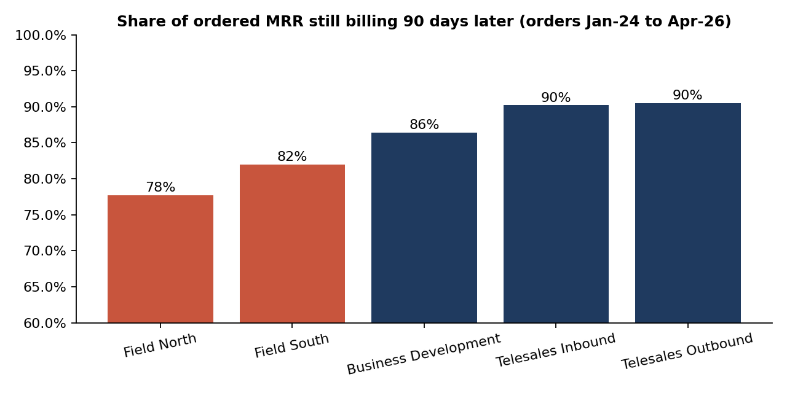
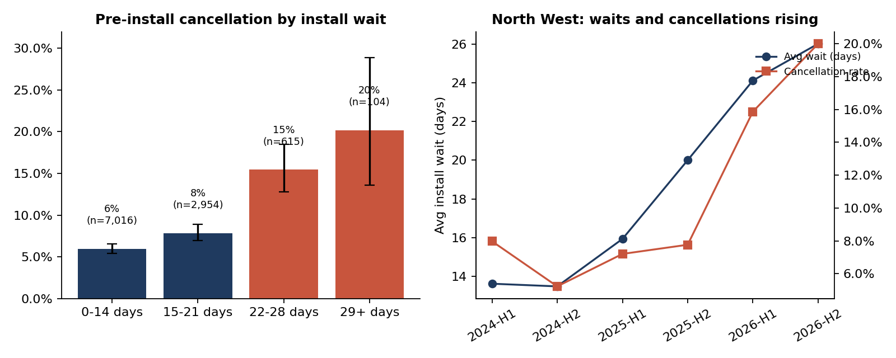
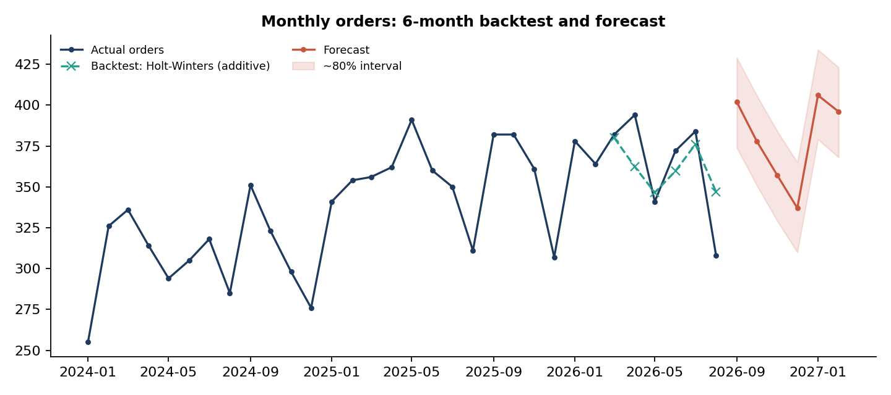

# Telecom Sales Performance & Revenue Analytics

**Sales funnel, quota, process-bottleneck and churn analysis for a fictional UK full-fibre broadband provider.**
SQL · Python (pandas, SciPy) · Excel · Tableau

> **Synthetic data notice.** "Kestrel Fibre" is fictional. All data was generated by `src/generate_synthetic_data.py`
> using documented behavioural assumptions ([docs/synthetic_data_design.md](docs/synthetic_data_design.md)), then
> deliberately corrupted with realistic data-quality defects. The findings demonstrate an analytical *method*;
> they are **not** claims about any real company or market.

---

## 1. Business problem

A sales director at a growing broadband provider sees healthy headline numbers: quota attainment above 100% for most
teams and order volume up year on year. But the MRR base grows more slowly than order volume suggests. The question
for this analysis: **where between "lead" and "revenue that stays" is value being lost, and what should the sales
organisation change first?**

## 2. Questions answered

1. Which lead sources convert, at which stage, and why? (funnel, win rate, sales cycle, deal size)
2. Is quota attainment a reliable measure of sales performance, or does it reward low-quality sales?
3. Are there process bottlenecks *after* the sale that destroy revenue? (installation wait → cancellation)
4. Is discounting buying extra wins or just giving away margin?
5. How many orders should we plan for over the next six months, and what headcount does a target imply?

## 3. Key findings

| # | Finding | Evidence | Confidence |
|---|---|---|---|
| 1 | **Field (door-to-door) sales hit quota but lose the most revenue after the sale.** Door-to-door customers churn within 90 days at **11.3%** vs **4.2%** for other residential sources (2.7×). Field teams keep only **78–82%** of ordered MRR at day 90, vs **90%** for telesales. | 95% CI for the difference: +5.7 to +8.4 pp. 31% of door-to-door early churners cite "did not understand contract terms" vs 8.5% elsewhere. | High (large n, consistent across both field teams) |
| 2 | **Installation wait is a revenue leak, concentrated in the North West.** Pre-install cancellations rise from **6.0%** (≤14-day wait) to **15.4%** (22–28 days) and **20.2%** (29+ days). North West average waits grew from **13.6 to 24–26 days**, and its cancellation rate doubled (6.6% → 13.3%). | Logistic regression controlling for channel, segment and region: each extra week of wait multiplies the odds of cancellation by **1.53** (95% CI 1.37–1.70). After controlling for wait, the North West itself has no extra effect (OR 0.96), so *the wait explains the region's problem*. | Medium-high. Observational, so it shows association, not proven cause (see §7) |
| 3 | **Discounts above 10% buy no additional wins.** Within door-to-door, moving from 0% to 10% discount lifts win rate by **+8.0 pp** (CI +4.5 to +11.4). Moving from 10% to 15–20% changes it by **−1.2 pp** (CI −4.2 to +1.9, p = 0.45). Web shows the same pattern. Discounts of 15%+ cost **~£50k/year** in MRR given away. | Compared *within* source, because field reps discount more (a pooled comparison would confuse channel with discount). One apparent effect (Inbound Call, p = 0.046, n = 207) does not survive a multiple-comparison correction. | Medium: the CI cannot rule out a small (≤2 pp) effect, hence a pilot rather than a hard rule |
| 4 | **Quotas are miscalibrated in both directions.** Outbound quotas rose 15% in 2026 while outbound lead supply fell ~17% (852 → 704 leads/month): attainment dropped from 113% to **81%**. Business Development hit **185%** in 2025, a sign the quota was set too low. | `sql/04`, Team_Quota sheet | High for the direction; the right quota level needs capacity data |
| 5 | **New reps close at ~70% of the rate of ramped reps** (28.4% vs 38.7% in their first 3 months, all channels). | This supports ramped quotas for new starters and informs the capacity planner. | High |




**Forecast.** A 6-month backtest compared seasonal-naive, trend × seasonal-index and Holt-Winters models. Holt-Winters
had the lowest error (MAPE 4.7% vs 6.2% and 7.1%). It forecasts **~2,275 orders for Sep-2026 to Feb-2027**
(vs 2,181 in the previous six months), with the usual December dip. The ~80% band is ±28 orders/month and indicative
only: one 6-month holdout is a small test.



## 4. Recommendations

| Recommendation | Owner | How to measure it | Expected effect (on this data) |
|---|---|---|---|
| **Add a quality component to field sales targets** (e.g. commission on MRR still billing at 90 days, or a 90-day clawback). Add a 48-hour welcome call for door-to-door orders that re-explains contract terms. Pilot in one field team first. | Sales Ops + Field Sales managers | 90-day churn and % ordered MRR retained at 90d, pilot team vs control team | Closing half the gap to other channels' churn keeps ~10 more customers per quarter (~£320 MRR, ~£6.5k contract value) at current volume |
| **Flag orders at risk before they cancel**: a weekly report of orders with a >21-day install slot, with a proactive customer contact. Escalate North West install capacity to Operations with the cost quantified. | Sales Ops → Operations | Cancellation rate in the 22+ day bands; NW average wait | NW excess cancellations: ~42 orders ≈ £1.5k MRR (~£18k/year revenue) in the last 12 months |
| **Discount governance pilot**: cap discretionary discount at 10% and require approval above it. Run for 8 weeks in one field team. | Sales Ops + Finance | Win rate (guardrail), average discount, MRR per order | Up to ~£20k/year saved. Worst case within the CI: ~18 fewer door-to-door orders/year (~£7k revenue), still net positive |
| **Recalibrate quotas from capacity and lead supply**, not a flat % uplift; keep ramped quotas for new starters. | Sales leadership | Share of rep-months at quota per team (target: similar across teams) | Fairer targets; fewer "structurally impossible" quotas in Outbound |
| **Pre-qualify credit on the doorstep**: 44% of door-to-door losses happen at the credit check, after the full pitch. | Field Sales + Product | Rep time per order; credit-check stage losses | Fewer wasted visits (time data needed to size) |

## 5. Dataset

| Table | Grain | Rows (clean) | Notes |
|---|---|---:|---|
| `leads` | 1 per lead | 77,005 | 7 sources, 6 UK regions, Jan-2024 → Aug-2026 |
| `opportunities` | 1 per opportunity | 28,847 | stage dates, outcome, product, discount, MRR, install and activation |
| `customers` | 1 per activated customer | 9,957 | activation, churn date and reason |
| `reps` | 1 per sales rep | 49 | 5 teams, hires and leavers (~26% annual attrition) |
| `quotas` | 1 per rep-month | 836 | ordered-MRR quota with ramp for new starters |
| `products` | 1 per package | 7 | residential and business fibre, 1G leased line |

The raw exports contain **~14,600 defect instances**: duplicates, test records, 1,602 UK-format dates, 4,596 inconsistent region labels, 3,547 inconsistent source labels, "£" stored in numeric fields, impossible date sequences, out-of-range discounts and blank loss reasons.
Every cleaning decision and its row count is in [docs/data_quality_log.md](docs/data_quality_log.md). The rule used
throughout: **standardise what is unambiguous, recover what can be verified from another field, flag what cannot be
verified, and exclude a flagged record only from the metric it would distort.** For example, 54 out-of-range discounts
were *recovered exactly* from list price vs net MRR. 36 orders with a close date before their creation date were kept
in win counts but excluded from cycle-time metrics.

## 6. Methodology

```
raw CSV exports ──► clean_data.py ──► clean tables ──► run_sql.py (SQLite) ──► 21 query outputs
   (defects)        (logged rules)         │                                        │
                                           ├──► analysis.py: tests, CIs, logistic ◄─┘ reconciliation
                                           │    regression, forecast backtest, figures
                                           ├──► build_excel_dashboard.py ──► Excel dashboard (live formulas)
                                           └──► export_tableau.py ──► Tableau extracts + build guide
```

- **SQL** (`sql/01`–`09`): funnel, stage progression, win rate, median sales cycle (window functions), quota
  attainment, cohort-safe churn, MRR bridge (recursive CTE calendar), install-wait analysis, discount analysis,
  stage-weighted pipeline.
- **Statistics** (`src/analysis.py`): Wilson confidence intervals, chi-square test, two-proportion tests with CIs,
  logistic regression (implemented with IRLS, controlling for confounders), multiple-comparison correction, and a forecast
  backtest across three methods.
- **Reconciliation**: the Python script asserts that pandas and SQL agree on win rate and churn for every source. The
  Excel dashboard values were checked against the SQL outputs, and the Excel-built forecast matches the Python
  implementation of the same method to two decimals.

## 7. Limitations (read before quoting any number)

- **Synthetic data.** Effects exist because the generator encodes them (documented). The analysis did *not* have access
  to hidden variables such as individual rep skill, and had to deal with confounding, censoring and noise as it would
  with real data.
- **Association vs causation.** The install-wait finding is observational. Customers who get long waits may differ
  in ways the data doesn't capture. The clean test is a before/after comparison when North West capacity is added,
  or a randomised "proactive contact" pilot for at-risk orders.
- **Censoring.** 90-day churn is measured only on customers activated ≥ 90 days before the snapshot; the sale-quality
  comparison uses orders up to Apr-2026 only.
- **MRR base.** Only customers acquired since Jan-2024 are in the extract, so "ending MRR" is the MRR of the analysed
  cohort, not the company's total.
- **Capacity planner.** Historical leads per rep reflect lead *supply* as much as rep *capacity*. Real planning should use
  activity data (calls or visits per hour), which this dataset does not contain.
- **Forecast.** One 6-month holdout. The model ranking could change with a rolling-origin backtest.

## 8. Repository structure

```
├── README.md
├── data/
│   ├── raw/            # CRM, billing and HR exports WITH defects (synthetic)
│   └── clean/          # analysis-ready tables (output of clean_data.py)
├── sql/                # 01–09 analysis queries (SQLite; standard CTE/window syntax)
├── src/                # generate → clean → run_sql → analysis → excel → tableau
├── analysis/
│   ├── sql_outputs/    # every query result as CSV
│   ├── outputs/        # statistical tests, forecast, key_metrics.json
│   └── figures/        # charts used in this README
├── dashboard/
│   ├── Kestrel_Sales_Performance_Dashboard.xlsx
│   └── tableau/        # data extracts used by the Tableau dashboards
└── docs/               # KPI definitions, data dictionary, data-quality log, synthetic data design,
                        # stakeholder memo, Tableau build guide
```

## 9. Tableau dashboards

**[View the interactive dashboards on Tableau Public](https://public.tableau.com/app/profile/lazar.mihajlovic/viz/KestrelFibreSalesAnalyticssyntheticdata/ExecutiveOverview)**

Built in Tableau from the extracts in `dashboard/tableau/`, starting with an executive overview of the headline sales
KPIs. The data model and calculated fields are documented in [docs/tableau_build_guide.md](docs/tableau_build_guide.md).

## 10. Excel dashboard

`dashboard/Kestrel_Sales_Performance_Dashboard.xlsx`: 2,565 live formulas over the row-level data, with no pasted results
except where labelled.

- **Dashboard**: 8 KPI tiles and 6 charts. The tiles and channel charts respond to the Year and Lead-source dropdowns.
- **Channel, Monthly, Team_Quota, Process, Discount**: supporting analysis, built with `COUNTIFS`/`SUMIFS`/`AVERAGEIFS`.
- **Forecast**: a trend × seasonal-index model built entirely from formulas, shown next to the Python Holt-Winters forecast and the backtest table.
- **Planner**: a reverse funnel. Enter a target MRR, and it calculates the orders, opportunities and leads needed by source, then the reps needed by team (including a new-starter ramp adjustment).

## 11. Reproduce

```bash
pip install -r requirements.txt
./run_all.sh                            # or run the steps one by one:
python src/generate_synthetic_data.py   # raw data (seeded, deterministic)
python src/clean_data.py                # clean data + docs/data_quality_log.md
python src/run_sql.py                   # builds data/kestrel_sales.db, runs sql/*.sql
python src/analysis.py                  # tests, forecast, figures, key_metrics.json
python src/build_excel_dashboard.py     # Excel dashboard (open in Excel to calculate)
python src/export_tableau.py            # Tableau extracts
```

## 12. Documentation

| Document | What's in it |
|---|---|
| [docs/insights_memo.md](docs/insights_memo.md) | One-page memo to the Head of Sales: findings, recommended pilots, uncertainties |
| [docs/kpi_definitions.md](docs/kpi_definitions.md) | Each KPI: formula, why it was chosen, how to read it, limitation, action |
| [docs/data_dictionary.md](docs/data_dictionary.md) | Every column of the clean tables and Tableau extracts |
| [docs/data_quality_log.md](docs/data_quality_log.md) | Every cleaning rule with row counts (auto-generated) |
| [docs/synthetic_data_design.md](docs/synthetic_data_design.md) | How the data was generated and which effects were encoded |
| [docs/tableau_build_guide.md](docs/tableau_build_guide.md) | Data model, calculated fields and layouts to rebuild the dashboard in Tableau |

## 13. What I would do first with real CRM data

Validate the definitions with Sales Ops: what counts as a "won" deal, and when does quota credit happen? Then check
lead-source attribution, which is usually the messiest field. Next, add activity data (calls and visits) so capacity
planning can use real throughput, and replace the single forecast holdout with a rolling backtest.

---
*Independent portfolio project by Lazar Mihajlović. Interactive version: [Tableau Public](https://public.tableau.com/app/profile/lazar.mihajlovic/viz/KestrelFibreSalesAnalyticssyntheticdata/ExecutiveOverview).*
